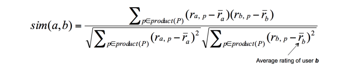

# 读取数据

* 活动信息(read_file.get_events())：构建一个字典，格式为每个key对应一个社团id，value为该社团的所有活动信息，该信息也使用字典进行存储，所包含的key有活动限额(num)，活动时间(time)，组织者(org)，响应为yes的成员id(yes)，响应为maybe的成员id(maybe)，响应为no的成员id(no)。其中后四个所对应的value为列表类型，其余为字符串类型。
* 社团信息(read_file.get_groups())：构建一个字典，格式为每个key对应一个社团id，value为该社团具体信息，该信息也使用字典进行存储，所包含的key有社团发起人(org)，社团主题(topic)，value均为列表类型。
* 成员信息(read_file.get_members())：构建一个字典，格式为每个key对应一个成员id，value为该成员的兴趣字典，即key为兴趣id，value初始为1（为以后打分方便）。

# 第一部分（基本推荐）

## 思路：

具体到社团，对于每个社团的活动，通过比较社团的主题和成员的兴趣来进行推荐。关于参数的设定，初始参数采用多次取随机数确定大致范围后手动进行微调的方法确定，在小范围内参数不敏感。

* split.members_update_by_train(members, groups, events_train)

输入：members（原有的打分情况）、groups（社团信息）、events_train（活动信息）

输出：members（更新后的打分情况）

功能：根据训练数据信息对成员兴趣打分进行更新。

实现：对于每一社团的每一活动信息，若成员参与活动，该成员所对应的该社团的所有主题兴趣加一，若不参加则减一。

* comp_base.scores_comp(org, list2, group_topic, members)

输入：org（组织者列表）、list2（待计算得分成员列表）、group_topic（社团主题列表）、members（成员信息）

输出：scores（成员得分情况）

功能：计算所要推荐成员对于该活动的得分情况

实现：计算每个成员对于该社团主题的平均打分，即为对该活动的得分。

## 对比实验：

* pattern=0：只考虑原文件所给的成员兴趣，不使用训练集中成员参与活动的信息；
* pattern=1：在原文件所给的成员兴趣基础上，调用split.members_update_by_train(members, groups, events_train)对成员兴趣进行更新；
* pattern=2：在1的基础上引入时间戳，只考虑所要预测的活动时间点以前的活动对成员兴趣的影响；

结果见result.xlsx中pattern=0，1，2部分数据。

# 第二部分

## 构建网络

* 相似度网络（comp_base.sims_comp()）

  * 带权：针对每个活动构建一个只包含所要预测成员的网络，网络权值计算为协同过滤中基于兴趣打分相似度的计算（该兴趣只局限于该社团的主题）

  

  

  * 无权：构造过程与带权图一致，设置一个阈值，当相似度高于阈值边为1，否则为0
  * *思考：这里还可以将统计的兴趣打分扩大到整个兴趣集进行尝试，但需要相应的时间代价；也可以尝试不区分每个活动而对于整个训练集计算相似度*

* 共同出现次数网络（build_graph.py）

  * 带权：对于给定的训练集构建一个网络，网络权值计算为两个人对于同一个活动的响应结果相同的次数除以两个人对于活动响应的总次数（若两个人同为活动组织者，我们计算时将分子额外加1）
  * 无权：对于给定的训练集构建一个网络，当两个人对于某个活动的响应结果一致（或者两个人均为某个活动的组织者）时，两者之间添加一条边，否则无边。
  * *思考：可以针对每个社团都构建一个网络，建立边时可以考虑设置阈值，方法类似上一个无权图。*

## 预测结果

因为社交网络中，我们需要知道其中某一个或某一些人的行为才能对其他人的行为做出预测，所以我们在这一部分借用了第一部分实现的基本推荐的结果。我们构建了上述两种网络，并尝试了不同方法：

* pattern=3：在1的基础上引入相似度网络（有权），采用社交约束；
* pattern=4：在2的基础上引入相似度网络（有权），采用社交约束；
* pattern=5：在1的基础上引入共同出现次数网络（无权），采用社交约束；

* pattern=6：在1的基础上引入共同出现次数网络（有权），采用社交约束；
* pattern=7：1的基础上引入相似度网络（无权），采用社交约束；

* comp_high.scores_high_comp：在1的基础上引入共同出现次数网络（有权），采用社交级联；

结果见result.xlsx中pattern=3，4，5，6，7部分数据及result-g1.xlsx和result-g2.xlsx。

# 计算方法

* 共同出现次数社交约束

* 相似度网络社交约束

